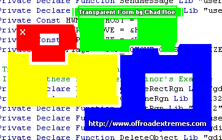



## Better Transparent Form/Image

### Description

After looking at all of the transparent form examples here on Planet Source Code, I decided to write my own. Every current example either makes everything on the form transparent or uses WAY TOO MUCH code. I wrote a very small example that uses 1 form and 1 line of code. It uses a Function that I believe was written by Robert Gainor. Gainor himself wrote an example that used 4 forms and 4 modules. That was just way too much. I reduced it to 1 form, 1 line of code and just a few Declarations and Constants. My example is extremely fast, extremely clean as well as the most simple on PSCode!
 
### More Info
 
Simply enter the LONG value of whatever color you want to become transparent.

This example will NOT turn the specified transparent colored areas of controls transparent. It will only turn the specified transparent colored areas of the IMAGES you place on the form transparent.

Wherever the image is the color you specified to be transparent, you will be able to see through the form there. Look at my ScreenShot for an example.

It takes roughly 1 second for the transparency to be drawn. You might notice that it takes a second between hitting the RUN button and actually seeing the code. 99.99% of your users will never even notice it.

             |
---                |---
**Submitted On**   |2005-10-27 01:25:20
**By**             |[Chad Roe](https://github.com/Planet-Source-Code/PSCIndex/blob/master/ByAuthor/chad-roe.md)
**Level**          |Beginner
**User Rating**    |4.6 (23 globes from 5 users)
**Compatibility**  |VB 4\.0 \(32\-bit\), VB 5\.0, VB 6\.0
**Category**       |[Miscellaneous](https://github.com/Planet-Source-Code/PSCIndex/blob/master/ByCategory/miscellaneous__1-1.md)
**World**          |[Visual Basic](https://github.com/Planet-Source-Code/PSCIndex/blob/master/ByWorld/visual-basic.md)
**Archive File**   |[Better\_Tra19435910272005\.zip](https://github.com/Planet-Source-Code/chad-roe-better-transparent-form-image__1-63040/archive/master.zip)

